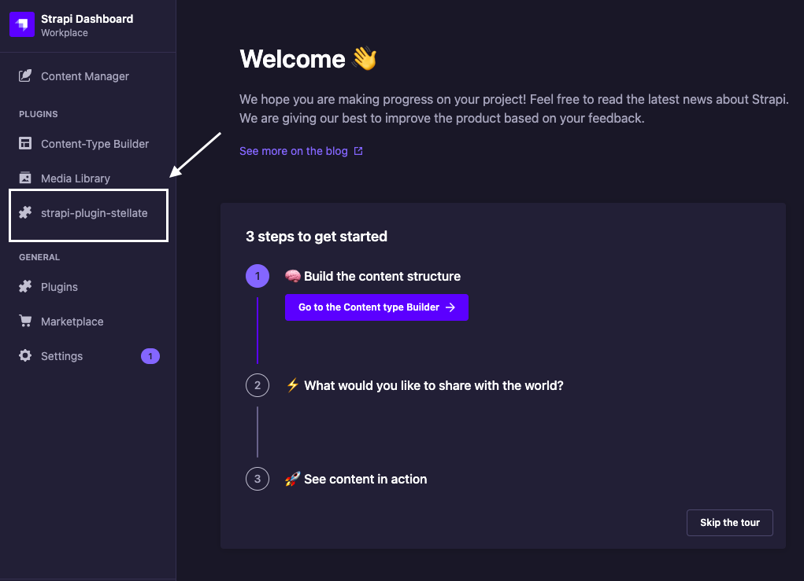
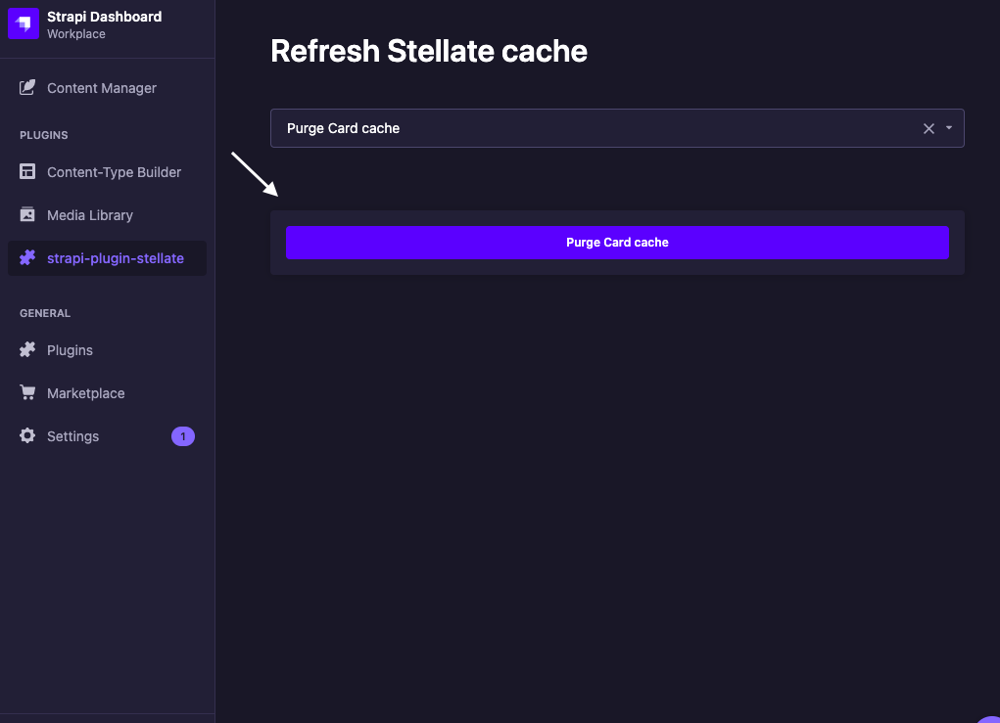
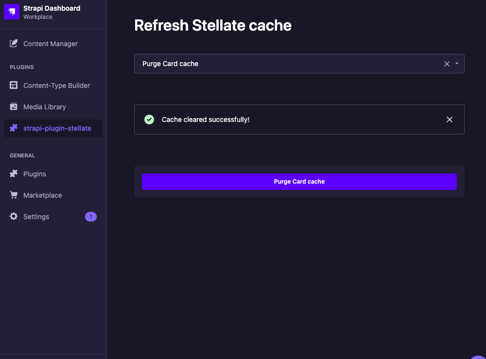

# strapi-plugin-stellate

Strapi Plugin Stellate is a plugin for the Strapi headless CMS that provides a convenient way to purge the cache.

## Instalation

To install this plugin, you can run the following command in your Strapi project:

```
npm install strapi-plugin-stellate
```

OR

```
yarn add strapi-plugin-stellate
```

## Configuration

Configure the plugin by adding the necessary lines to the `config/plugins.js` file in your Strapi application, including the Stellate API endpoint URL and authentication token.

```
module.exports = ({ env }) => ({
"stellate": {
    enabled: true,
    config: {
      stellateToken: <STELLATE_TOKEN>,
      stellateUrl: <STELLATE_URL>,
    },
  },
})
```

`STELLATE_URL :` URL endpoint of the Stellate API service used to clear the cache.

`STELLATE_TOKEN :` An authentication token used to access the stellate API.

Note: This information should be provided in the plugin configuration. You would need to enter the correct URL endpoint and necessary authentication or authorization tokens to successfully clear the cache.

## Usage

To clear the cache after running `npm run develop` or `yarn develop` in the Strapi application, go to the dropdown and select the collection type for which you want to clear the cache, then click Purge Cache, which will make an HTTP request to the designated URL endpoint with the required authentication token and clear the Strapi CMS cache.





## Contribution

If you would like to contribute to the development of Strapi Plugin Stellate, you can do so by following these steps:

Fork the repository on GitHub.
Make your changes and commit them to a new branch on your fork.
Submit a pull request to the main repository with a description of your changes.
Your contributions are appreciated!
